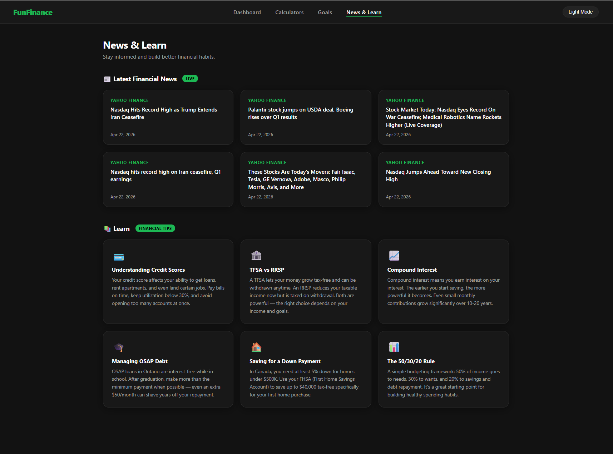
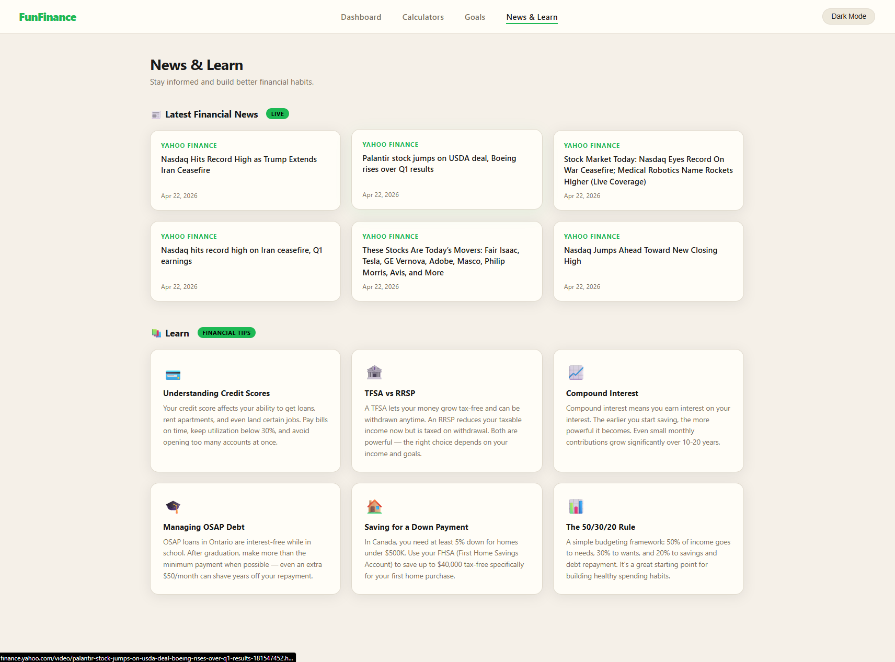
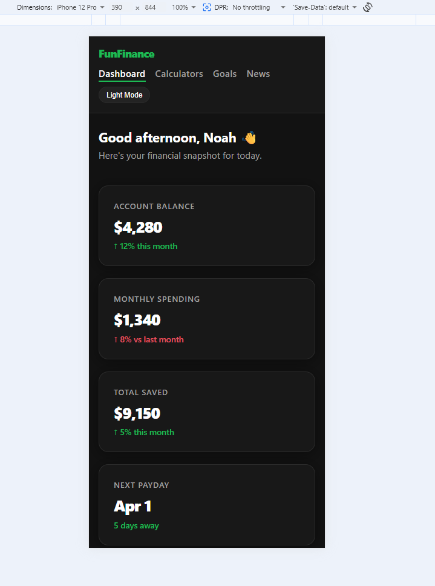
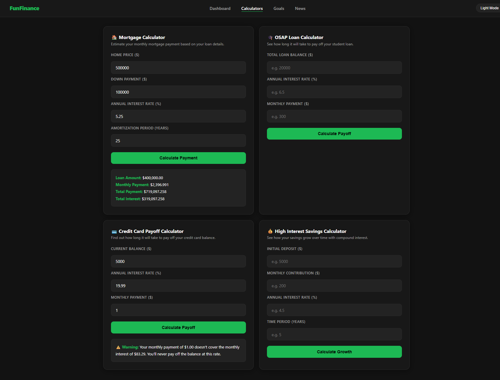

# FunFinance - Interactive Personal Finance Dashboard

FunFinance is our interactive financial dashboard designed to help young adults manage their finances in a more engaging way. Instead of staring at a boring Excel spreadsheet, users get animated charts, color-coded progress bars, financial calculators, and a news feed that keeps them up to date on current market conditions and some basic tips and tricks for proper financial health. 

---

## Our Purpose

As young adults ourselves, we understand that a lot of people our age struggle to understand where their money is going, or how to achieve financial freedom when faced with the burden of credit card debt and student loans. We aimed to solve this problem by presenting the data visually; making budgeting rewarding rather than a chore. 

Our Target Audience: Young adults (18-30) looking for a simple, visually appealing, swiss army knife tool to manage their expenses, tackle their loans and debts, and remain up to date on current financial news and market changes. 

---

## Features

- Splash Page: Personalized onboarding with session-based username storage.
- Dashboard: A personalized at-a-glance financial snapshot with stat cards, animated spending breakdown bar chart, and an animated spending category doughnut/pie chart.
- Calculators: Four financial calculation tools: Mortgage calculator, OSAP Loan Payoff calculator, Credit Card debt payoff calculator, and a fun High-Interest Savings account simulator. 
- Goals Page: A tracker with fun, animated, color-coded progress bars that let a user visually understand where their money is going, set budgets/limits for themselves, and be motivated to reach savings goals by watching the animated bar get higher and higher. All goals/limits are saved in localStorage so the user won't have to re-add them every session. 
- News Page: Live financial news feed via RSS and a financial quick-tips section to edcucate the user on healthy financial habits. 
- Dark/Light Theme: Theme toggle selection per page, and theme choice persists across all pages via localStorage. 
- Responsive Layout: Fully optimized for both desktop and mobile layouts. 

---

## Screenshots

- Dark Mode Example:

- Light Mode Example:

- Refined Mobile Formatting:

- Calculators In Action:

---

## Installation and Setup

Our website is made purely with HTML, CSS, and JavaScript. There are no build tools required!

To Run Locally:

1. Clone the repository (in VSC terminal: bash):

    git clone https://github.com/nowaynoah/finance-dashboard.git

2. Navigate into the project folder (in VSC terminal: bash):

    cd finance-dashboard

3. Right-click on 'splash.html' in VSC, click 'Reveal in File Explorer', and double click the file in File Explorer

4. Enjoy our project!

No server required. All data is stored in the browser via localStorage and sessionStorage.

---

## Team Members & Contributions

- Amaan Noah Mawani | Lead Developer & Design Specialist | Splash Screen, Dashboard, Base HTML/CSS Formatting, Dark/Light Theme, Goals Page, News Page, Mobile Formatting; JS Logic for Splash, Dashboard, Goals, News Pages |

- Ashley Greene | Design Specialist | Project Proposal, Website Concept, Foundation for Calculator Page HTML, CSS, and JS logic; Mobile Formatting |

---

## Project Resources

- Live Site: [FunFinance](https://nowaynoah.github.io/finance-dashboard/)
- Project Board: [FunFinance](https://github.com/nowaynoah/finance-dashboard/projects)

- Feature Branches:
    - 'feature/calculators'
    - 'feature/goals'
    - 'feature/news'

---

## Video Presentation

---

## Tech Used in Development

- HTML5
- CSS3 - Custom properties, CSS Grid, Flexbox, media queries
- JavaScript - DOM manipulation, localStorage, sessionStorage, Fetch API
- Chart.js - Sleek data visualization
- rss2json API - Live financial news feed

---

## Notes

FunFinance currently uses demo data. In a future version, users will be able to manually input their financial data for fully personalized experience. Ideally, a backend with real bank integration via Plaid API would make this an extremnely simple, yet actually marketable tool in the FinTech space. 
